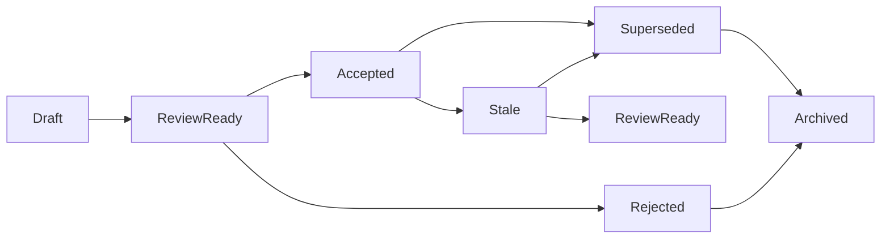

# Artifact Control-Plane Spec
Version: 1.0
Status: Review ready
Task: P0.1 — Artifact registry, dependency graph, and promotion model

## 1. Purpose

This spec defines the repo/program control-plane artifact model for the platform plan.

It standardizes:

- artifact taxonomy and ID patterns,
- registry fields and seed records,
- dependency graph edge semantics,
- promotion lifecycle and acceptance gates,
- stale-marking and stale-propagation rules,
- validation-hook standards for downstream artifacts.

This is a control-plane spec for planning/specification artifacts.
It is not the runtime product ontology.
Runtime objects such as Run, Artifact, Branch, Proof Bundle, or Writeback Proposal remain governed by the source-authority documents and later semantic packs.

## 2. Scope boundaries

### In scope

- Source-authority and control-plane artifacts
- Canon/glossary/interpretation artifacts
- Semantic contract packs
- Technical architecture and Platform Gate packs
- Release contract packs
- Reusable execution/governance/proof packs
- Surface/repo architecture packs
- Implementation blueprints and execution packets
- Sync/delta/stale-detection artifacts

### Out of scope

- P0.2 repo/agent operating contract content
- P0.3 Factory-specific operating contract content
- Product-runtime object schemas
- Full stale-detection automation
- Any second orchestration stack

## 3. Design constraints carried forward

This control plane must preserve accepted baseline decisions:

- Chat is never the source of truth.
- Repo layout is a storage convention, not the platform architecture.
- No app/private view may create a competing truth model.
- Distinct lanes such as artifact, memory, canon, workflow, and export remain separate in product semantics.
- Factory is the base execution tool; CrewAI is not part of the base plan.
- Human-owned meaning and acceptance remain human-gated.

## 4. Core registry model

The registry has two first-class record kinds:

1. `artifact_type` — the reusable definition for a family of control-plane artifacts.
2. `artifact` — one concrete artifact instance.

### 4.1 Common artifact record fields

Every concrete artifact record must carry at least:

- `artifact_id`
- `artifact_type_id`
- `title`
- `version`
- `artifact_status`
- `semantic_owner`
- `stewardship_mode`
- `acceptance_authority`
- `canonical_locator`
- `source_authority_refs`
- `dependency_refs`
- `validation_hooks`
- `stale_rule_id`
- `notes`

### 4.2 Common field meanings

- `semantic_owner`: human steward of meaning and correctness.
- `stewardship_mode`: one of `human_only`, `human_factory`, `factory_first`.
- `acceptance_authority`: who may mark the artifact accepted for downstream use.
- `canonical_locator`: canonical repo path or external locator.
- `source_authority_refs`: source-authority artifacts materially governing meaning.
- `dependency_refs`: structured dependencies on other control-plane artifacts.
- `validation_hooks`: explicit checks or reviews required before acceptance or re-acceptance.
- `stale_rule_id`: default stale rule applied to this artifact.

### 4.3 Status model

Artifact lifecycle status is independent from the master-plan task legend.
There is no one-to-one mapping between task completion and artifact promotion.

Allowed `artifact_status` values:

- `draft`
- `review_ready`
- `accepted`
- `stale`
- `superseded`
- `archived`
- `rejected`

### 4.4 Dependency reference shape

Each dependency reference uses this shape:

```json
{
  "edge_type": "depends_on",
  "artifact_id": "cp.master-plan.v1",
  "propagation_mode": "auto",
  "required_for_acceptance": true,
  "notes": "Baseline product truth and task rules"
}
```

Allowed `propagation_mode` values:

- `auto` — upstream accepted change marks downstream artifact `stale`
- `manual` — upstream change requires human stale review before status changes
- `revalidate` — upstream change requires validation rerun, not automatic stale
- `none` — no stale propagation by default

### 4.5 Validation hook shape

Each validation hook uses this shape:

```json
{
  "hook_id": "vh.manual.acceptance",
  "hook_kind": "manual_acceptance",
  "executor_mode": "human",
  "blocking": true,
  "evidence_required": "Acceptance note or explicit approval in the task record",
  "result_ref": null
}
```

Allowed `hook_kind` values:

- `schema`
- `dependency_integrity`
- `source_trace`
- `consistency_review`
- `manual_acceptance`
- `revalidation`
- `test_or_fixture`

## 5. Artifact type catalog

All artifact types below inherit the common field set in Section 4.

| artifact_type_id | Name | Purpose | Default semantic owner | Default stewardship mode | Default acceptance authority | ID pattern | Extra required metadata | Default repo location | Default stale rule |
| --- | --- | --- | --- | --- | --- | --- | --- | --- | --- |
| `sa.source_authority_doc` | Source authority document | External or mirrored authority document governing platform meaning | Product/canon owner | `human_only` | Human plan owner | `sa.<source-key>.v<major>` | `source_key`, `authority_scope` | `docs/control-plane/source-authority/<slug>.md` | `sr.source-authority.strict` |
| `cp.master_plan_record` | Master execution plan record | Working control document for the program | Product/canon owner | `human_only` | Human plan owner | `cp.master-plan.v<major>` | `phase_scope` | `docs/control-plane/core/master-plan.md` | `sr.control-plane.strict` |
| `cp.control_plane_spec` | Control-plane spec | Normative spec for registry, rules, or operating artifacts | Product/canon owner | `human_factory` | Human plan owner | `cp.<topic>.v<major>` | `topic_key` | `docs/control-plane/core/<slug>.md` | `sr.control-plane.strict` |
| `cp.control_plane_dataset` | Control-plane dataset | Machine-readable registry/graph/control-plane data | Platform architecture steward | `human_factory` | Human plan owner | `cp.<topic>-data.v<major>` | `dataset_kind` | `docs/control-plane/core/<slug>.json` | `sr.control-plane.strict` |
| `canon.interpretation_pack` | Canon / glossary / contradiction pack | Fixes normalized terminology and resolved interpretation | Product/canon owner | `human_factory` | Human plan owner | `canon.<topic>.v<major>` | `canon_scope` | `docs/control-plane/canon/<slug>.md` | `sr.derivative.manual` |
| `sem.semantic_contract_pack` | Semantic contract pack | Defines shared semantic contracts and state-machine packs | Semantic contracts steward | `human_factory` | Human semantic owner | `sem.<topic>.v<major>` | `semantic_scope` | `docs/control-plane/semantics/<slug>.md` | `sr.derivative.manual` |
| `arch.technical_architecture_pack` | Technical architecture pack | Defines technical baseline, Platform Gate, topology, and interfaces | Architecture steward | `human_factory` | Human architecture owner | `arch.<topic>.v<major>` | `architecture_scope` | `docs/control-plane/architecture/<slug>.md` | `sr.derivative.manual` |
| `rel.release_contract_pack` | Release contract pack | Defines Platform Gate or release-specific product/SDK contracts | Release doctrine steward | `human_factory` | Human release owner | `rel.<stage>.v<major>` | `release_id` | `docs/control-plane/releases/<stage>/<slug>.md` | `sr.derivative.manual` |
| `reuse.execution_governance_pack` | Reusable execution / governance / proof pack | Defines governance, proof, protocol, workflow, applet, or handoff contracts | Governance/proof steward | `human_factory` | Human semantic owner | `reuse.<topic>.v<major>` | `reuse_scope` | `docs/control-plane/reuse/<slug>.md` | `sr.derivative.manual` |
| `surf.surface_repo_pack` | Surface / repo architecture pack | Defines surface contracts, repo/package architecture, or documentation plane | Surface/repo steward | `human_factory` | Human architecture owner | `surf.<topic>.v<major>` | `surface_scope` | `docs/control-plane/surfaces/<slug>.md` | `sr.derivative.manual` |
| `bp.implementation_blueprint` | Implementation blueprint | Release or module implementation blueprint for bounded build work | Implementation steward | `human_factory` | Human implementation owner | `bp.<scope>.v<major>` | `implementation_scope` | `docs/control-plane/implementation/<slug>.md` | `sr.derivative.manual` |
| `pkt.execution_packet` | Execution packet | Bounded implementation packet with whitelist, validators, and approval rules | Implementation steward | `factory_first` | Human implementation owner | `pkt.<scope>.v<major>` | `packet_scope`, `file_whitelist_ref` | `docs/control-plane/implementation/packets/<slug>.md` | `sr.derivative.manual` |
| `sync.delta_sync_pack` | Delta / sync / stale-detection pack | Records deltas, recurring sync, stale rules, and gate re-checks | Sync steward | `factory_first` | Human plan owner | `sync.<topic>.v<major>` | `sync_scope` | `docs/control-plane/sync/<slug>.md` | `sr.sync.manual` |

## 6. Dependency graph format

The dependency graph is directional.
Edges run from the downstream artifact to the upstream artifact it relies on.

### 6.1 Node fields

Each node must carry at least:

- `artifact_id`
- `artifact_type_id`
- `artifact_status`
- `canonical_locator`

### 6.2 Edge fields

Each edge must carry at least:

- `edge_id`
- `from_artifact_id`
- `to_artifact_id`
- `edge_type`
- `propagation_mode`
- `notes`

### 6.3 Edge types and stale semantics

| edge_type | Meaning | Default stale behavior |
| --- | --- | --- |
| `depends_on` | Hard prerequisite. Downstream meaning or validity depends materially on upstream artifact. | `auto` stale propagation |
| `derives_from` | Downstream artifact is materially derived from upstream artifact. | `auto` or `manual`, depending on transform determinism |
| `validated_by` | Upstream artifact defines the validator, fixture, or normative validation basis. | `revalidate`, not auto stale by default |
| `supersedes` | New artifact replaces an older artifact. | `none`; lineage only |
| `informs` | Reference-only link. Helpful context, not a hard validity dependency. | `none` |

## 7. Promotion lifecycle



### 7.1 Allowed transitions

- `draft -> review_ready`: artifact exists, required fields present, steward asserts readiness
- `review_ready -> accepted`: blocking hooks complete and human acceptance authority approves
- `review_ready -> rejected`: acceptance authority rejects the artifact for downstream use
- `accepted -> stale`: stale rule triggered and propagation mode allows status change
- `stale -> review_ready`: steward refreshes the artifact for renewed review
- `accepted -> superseded`: a replacement accepted artifact declares `supersedes`
- `superseded -> archived`: artifact retained only for lineage/history
- `rejected -> archived`: artifact retained only for audit/history

### 7.2 Transition authorities

- Stewards may create or update `draft` artifacts and move them to `review_ready`.
- Acceptance authorities alone may move an artifact to `accepted` or `rejected`.
- Factory may assist with structure checks and stale detection, but may not auto-accept human-owned meaning.
- Factory may auto-mark `stale` only where the triggering edge uses `auto`.
- `manual` and `revalidate` propagation require human review before renewed acceptance.

## 8. Stale-marking rules

### 8.1 Triggers

An accepted artifact becomes stale or review-blocked when any of the following occur:

1. A hard upstream dependency changes meaning through a newly accepted artifact.
2. A derived-from source changes in a way that invalidates the downstream derivation.
3. A canonical locator, dependency target, or required source-authority reference no longer resolves.
4. A correction entry changes the accepted interpretation of an upstream artifact.
5. A validator basis changes and the downstream artifact requires revalidation.

### 8.2 Stale reason recording

When stale evaluation happens, record at minimum:

- `stale_rule_id`
- triggering `artifact_id`
- triggering `edge_id` or dependency reference
- date/time of detection
- short reason note
- whether human review is required before status changes

### 8.3 Source-authority propagation

- Changes to source-authority artifacts do not force every downstream artifact stale automatically.
- They propagate only through explicit `depends_on` or `derives_from` edges.
- `informs` edges from source-authority artifacts do not stale downstream artifacts by default.
- Control-plane specs that define norms directly from source-authority artifacts should use `depends_on`.

### 8.4 Correction handling

Accepted corrections do not rewrite history.
They create a new accepted artifact or carry-forward entry.
Any downstream artifact with a hard dependency on the corrected artifact must be evaluated under its stale rule.

## 9. Validation-hook standards

The hook standard is realistic on purpose:
structural checks may be automated, but human-owned meaning is never auto-accepted.

| Artifact family | Blocking validation hooks | Notes |
| --- | --- | --- |
| Source authority | `source_trace`, `manual_acceptance` | Confirms locator, authority role, and human acknowledgement |
| Master plan / control-plane specs | `schema` or structure review, `dependency_integrity`, `source_trace`, `manual_acceptance` | Required before downstream use |
| Canon / interpretation packs | `dependency_integrity`, `source_trace`, `consistency_review`, `manual_acceptance` | Contradictions must be explicit, not buried |
| Semantic / architecture / release packs | `dependency_integrity`, `source_trace`, `consistency_review`, `manual_acceptance` | Meaning remains human-owned |
| Reuse / governance / surface packs | `dependency_integrity`, `consistency_review`, `manual_acceptance` | Must preserve shared semantics and authority boundaries |
| Blueprints / execution packets | `dependency_integrity`, `consistency_review`, `test_or_fixture` when applicable, `manual_acceptance` | Only use executable hooks where real fixtures exist |
| Sync / delta packs | `dependency_integrity`, `revalidation`, `manual_acceptance` | Supports later P7 automation without faking it now |

## 10. Default stale rule catalog

| stale_rule_id | Applies to | Rule |
| --- | --- | --- |
| `sr.source-authority.strict` | Source authority artifacts | Hard downstream dependencies become stale on accepted change; reference-only links do not |
| `sr.control-plane.strict` | Master plan, control-plane specs, control-plane datasets | Hard dependencies auto-stale; validator changes require revalidation |
| `sr.derivative.manual` | Canon, semantic, architecture, release, reuse, surface, blueprint, packet artifacts | Upstream accepted changes trigger stale review; deterministic derivations may use `auto` per edge |
| `sr.sync.manual` | Sync/delta/stale-detection artifacts | Upstream changes trigger review because these artifacts often summarize prior accepted truth |
| `sr.reference.none` | Reference-only links | No stale propagation by default |

## 11. Default repo placement

Because the repo currently has no control-plane area, the default root is:

`docs/control-plane/`

Default subpaths are storage conventions for control-plane artifacts only.
They do not define product-layer or package-layer architecture.

## 12. Seed coverage required by P0.1

The seed registry must cover at minimum:

- the master plan record,
- the three source-authority documents,
- this spec,
- the machine-readable seed registry,
- the machine-readable dependency graph,
- artifact type definitions for major downstream artifact families.

## 13. Why this design preserves the baseline

This control-plane design does not:

- privilege transcript/chat artifacts as truth,
- introduce app-private competing truth models,
- collapse product writeback lanes into one control-plane save concept,
- let repo shape dictate platform architecture,
- introduce a second orchestration stack.

It exists only to track planning/spec artifacts and their relationships so downstream tasks can rely on accepted artifacts without silent drift.
