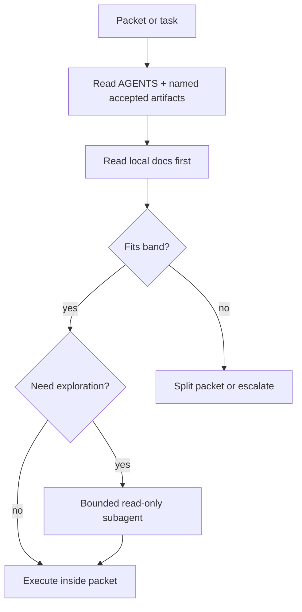

# Context-Budget and Packet Policy
Version: 1.0
Status: Accepted
Task: P0.5 — Context-budget and packet policy

## 1. Purpose

This artifact turns the accepted P0.2 packet-brief baseline into an explicit packet-budget and packet-composition policy for bounded repo work.

It exists to:

- make packet size targets explicit without turning packet briefs into a competing truth model,
- define human-legible context-budget bands for bounded work,
- define packet composition rules around the accepted packet-brief baseline,
- require a local-doc-first read order before broader repo exploration,
- bound subagent exploration so it remains additive rather than a second orchestration stack,
- define escalation rules when packet bounds no longer fit the work.

This is an execution-control artifact layered on top of accepted truth.
It does not redefine accepted product meaning, runtime architecture, or the packet-brief schema.

## 2. Scope boundaries

### In scope

- packet size targets and budget bands for bounded repo work
- packet composition rules on top of the accepted packet-brief baseline
- local-doc-first read policy for packet execution
- bounded subagent exploration rules
- escalation thresholds and escalation paths when packet bounds no longer fit
- explicit relation to the accepted-artifact-only default, packet-brief baseline, Factory operating contract, and forbidden-shortcuts register

### Out of scope

- changing the accepted P0.2 packet-brief schema
- changing the accepted-artifact-only rule
- changing P0.3 headless execution, autonomy bands, or review rules
- redefining P0.4 shortcut semantics as if they were new truth
- runtime context-compiler topology, token-window design, or P3.2 architecture work
- repo/package execution architecture from P6.x
- any second orchestration stack
- silent acceptance of newly defined packet-budget or context-policy semantics

## 3. Design constraints carried forward

- The three-layer architecture remains fixed: engine, shared environment, app/domain layer.
- Chat remains a projection over shared primitives, not the source of truth.
- Task Studio remains the north-star commissioned-work app.
- The chat-native release order remains fixed.
- No release or repo artifact may invent a private competing truth model.
- Repo layout remains a storage convention, not the platform architecture.
- Product truth remains human-owned.
- Factory.ai remains the base execution tool.
- CrewAI is not part of the base plan.
- The accepted-artifact-only default remains in force.
- The accepted packet-brief baseline remains in force.
- The accepted P0.3 Factory operating contract remains additive and must not be contradicted.
- The accepted P0.4 forbidden-shortcuts register remains fixed context for this artifact.
- If current enforcement points or future automation are referenced, they must be labeled accurately rather than implied.

## 4. Policy interpretation rules

### 4.1 Position in the control plane

This artifact extends the accepted P0.2 packet-brief baseline with packet-budget and packet-composition policy.

It does not:

- replace the accepted packet brief,
- change source authority,
- add a new truth layer,
- or redefine Factory execution behavior that already belongs to P0.3.

### 4.2 Human acceptance boundary

The packet-budget, local-doc-first, subagent, and escalation semantics defined here remain reviewable until explicitly accepted by a human.

Before explicit human acceptance:

- this artifact status must remain `review_ready`,
- P0.5 must remain open in `docs/control-plane/core/master-plan.md`,
- Phase 0 must remain in progress,
- newly defined P0.5 semantics must not be treated as accepted downstream truth.

After explicit human acceptance and passing validation:

- this artifact may move to `accepted`,
- P0.5 may be marked done,
- Phase 0 may be marked done if no other Phase 0 work remains,
- the carry-forward log may record the result as accepted downstream truth.

### 4.3 Current-vs-future enforcement rule

Current enforcement for packet scope and execution remains grounded in accepted P0.2 and P0.3 artifacts.
This artifact may name future review or lint needs, but it must not imply that new automation already exists.

### 4.4 Proposed additions rule

If a later session discovers a materially new packet-policy risk not already fixed by accepted artifacts:

- record it in a clearly labeled proposed-addition section,
- keep it non-accepted until explicit human approval,
- do not silently fold it into accepted baseline truth.

## 5. Budget model

### 5.1 Budget model purpose

P0.5 defines context budget as a human-legible governing and read-set policy for bounded work.

It does not define:

- runtime token packing,
- provider window management,
- or later context-compiler topology.

### 5.2 Budget terms

- **Governing accepted ref**: an accepted source-authority or accepted control-plane artifact that materially governs packet meaning, scope, validation, or acceptance.
- **Full local-doc read**: a repo-local document, spec, contract, or closely related file read end-to-end as part of the packet’s core execution basis.
- **Supporting read**: a targeted supporting read used to resolve a bounded question after governing artifacts and primary local docs have been read.
- **Subagent exploration**: bounded delegated exploration that stays read-only and reports back to the primary packet owner.
- **Band breach**: a packet state where the governing set, read set, exploration needs, or objective shape exceed the selected band.

### 5.3 Budget bands

| Band | Intended use | Governing accepted refs | Full local-doc reads | Supporting reads | Subagent exploration |
| --- | --- | --- | --- | --- | --- |
| `narrow` | small, direct packet work | up to 5 | up to 6 | up to 2 | none |
| `standard` | normal bounded multi-file or multi-artifact packet work | up to 8 | up to 10 | up to 4 | at most 1 bounded read-only subagent |
| `extended` | broad but still single-packet work | up to 12 | up to 15 | up to 6 | at most 2 bounded read-only subagents with explicit rationale |

If work exceeds the `extended` band, the default action is to split the packet or escalate rather than silently continue as one packet.

### 5.4 Band-selection rules

- Select the smallest viable band at packet creation time.
- Record the chosen band explicitly in packet notes, scope text, or an equivalent packet-local planning section until later schema work decides otherwise.
- Do not silently reclassify a packet upward mid-run.
- If the work breaches the selected band, stop and apply the escalation rules in Section 9.

### 5.5 Cross-band invariants

Every packet, regardless of band, must preserve all of the following:

- one dominant objective,
- one coherent touched-file scope or file whitelist,
- explicit governing accepted artifacts,
- explicit deliverables and validators,
- explicit approval handling,
- no silent authority widening,
- no hidden shift from local-doc-first reading to broad exploratory search.

## 6. Packet composition rules

### 6.1 Required composition elements

On top of the accepted P0.2 packet-brief baseline, every packet should make the following explicit:

- selected budget band,
- dominant objective,
- governing accepted refs,
- source-authority refs when materially shaping the work,
- touched files or file whitelist,
- primary local-doc set,
- optional supporting-read set,
- deliverables,
- validation hooks,
- approval requirements,
- escalation trigger if the selected band is breached.

### 6.2 Relation to the accepted packet-brief baseline

The accepted P0.2 packet brief remains the minimum structural contract.

Until later schema work exists:

- the band declaration does not require a new schema field,
- the primary local-doc set may be recorded in packet scope text or notes,
- the supporting-read set may be recorded in packet scope text or notes,
- this artifact must not be used to claim that the P0.2 schema has already changed.

### 6.3 Composition discipline

- Use accepted artifacts by default.
- Treat provisional, stale, superseded, or unregistered material as non-default inputs unless the task explicitly targets them.
- Do not combine multiple unrelated objectives only because the counts still appear to fit one band.
- Do not use a subagent summary as a substitute for the packet owner’s required governing or local-doc reads.
- Do not let repo placement or file adjacency imply platform architecture ownership.

## 7. Local-doc-first read policy

### 7.1 Required read order

Before broader repo exploration, the packet owner should read in this order:

1. root `AGENTS.md` and the nearest descendant `AGENTS.md`,
2. governing accepted artifacts explicitly named by the packet or task,
3. local docs nearest the touched files or touched subtree,
4. directly touched files or tightly adjacent local specs if they materially shape the work,
5. supporting reads only after the earlier steps are complete.

### 7.2 Broadening rules

Broader repo search is allowed only when:

- the local-doc-first pass leaves a bounded unresolved question,
- the broader read stays within the selected band,
- or an escalation is recorded before continuing.

When broadening happens:

- prefer accepted artifacts over provisional material,
- record why local docs were insufficient,
- keep the broadened read set tied to the dominant objective,
- stop if the broadened read would breach the selected band without approval.

### 7.3 What local-doc-first blocks

This policy blocks using broad repo search or delegated exploration as the default first move when the packet already identifies:

- touched paths,
- governing accepted artifacts,
- or nearby local documentation that should be read first.

## 8. Subagent exploration rule

### 8.1 Default posture

Subagent exploration is optional and additive.
It is never required for packet validity.
The primary packet owner remains responsible for scope, interpretation, validation, and final output.

### 8.2 Allowed use

Subagent exploration is allowed only when all of the following are true:

- the packet owner has already completed the local-doc-first pass required by Section 7,
- the remaining question is bounded and exploration-shaped,
- the exploration stays read-only,
- the subagent prompt is constrained to the packet’s objective and file/read boundary,
- the selected band allows the requested subagent count.

### 8.3 Band limits

- `narrow`: no subagent exploration
- `standard`: at most 1 bounded read-only subagent
- `extended`: at most 2 bounded read-only subagents, with explicit rationale

Any need beyond the `extended` limit is an escalation condition rather than a reason to widen the packet silently.

### 8.4 Disallowed uses

Subagent exploration may not be used to:

- bypass required local-doc-first reading,
- replace the packet owner’s read obligations,
- edit files or change artifact status by delegation,
- silently widen packet scope or authority,
- create a second orchestration stack,
- or self-accept human-owned meaning.

## 9. Escalation thresholds and escalation paths

### 9.1 Escalation triggers

Escalate or split the packet when any of the following occur:

- the packet no longer has one dominant objective,
- the governing set, full-read set, supporting-read set, or subagent count exceeds the selected band,
- the work requires provisional or stale material not explicitly targeted by the task,
- the packet needs broader authority than the packet or accepted contracts allow,
- the packet needs cross-phase runtime/compiler/repo-architecture decisions that belong to later work,
- the packet discovers conflicting accepted truth that it cannot reconcile inside scope,
- the packet would need broad exploratory search as the default mode instead of local-doc-first reading.

### 9.2 Required escalation actions

When escalation is triggered, the packet owner must do one of the following:

- split the work into multiple packets,
- return a scope gap,
- request explicit human clarification or approval,
- or stop and label the later-phase dependency rather than continuing inside P0.5 scope.

### 9.3 Silent escalation prohibition

Do not silently:

- widen the packet band,
- widen the file scope,
- add more subagents,
- pull in broader repo context,
- or reinterpret the work as if the original packet still fits.

## 10. Relation to accepted P0.2, P0.3, and P0.4 artifacts

### 10.1 P0.2 relation

P0.2 remains the baseline for:

- the accepted-artifact-only default,
- root and descendant `AGENTS.md` instruction layering,
- the lightweight packet-brief contract,
- control-plane synchronization expectations.

P0.5 adds packet-budget and composition policy on top of that baseline.
It does not redefine P0.2.

### 10.2 P0.3 relation

P0.3 remains the baseline for:

- Factory asset layout,
- bounded packet execution,
- headless execution conventions,
- review and approval rules for automated runs,
- failure handling.

P0.5 adds packet shaping, read-order, and escalation discipline on top of that baseline.
It does not change P0.3 autonomy bands or headless rules.

### 10.3 P0.4 relation

P0.4 remains the accepted anti-drift constraint set.

P0.5 uses that accepted register as fixed context, especially for:

- no transcript-first drift,
- no hidden memory sludge,
- no silent proposal application,
- no repo-shape architecture drift,
- no second orchestration stack by default.

P0.5 does not restate those constraints as newly discovered truth.

### 10.4 Current enforcement basis and deferred automation

Current enforcement remains grounded in accepted P0.2 and P0.3 artifacts plus existing review discipline.
This artifact does not claim that packet-band linting, local-doc-first automation, or subagent-budget automation already exists.

## 11. Explicit non-goals

This artifact is not:

- a runtime context-compiler spec,
- a model-token budgeting contract,
- a packet-brief schema migration,
- a P0.3 Factory contract rewrite,
- a repo/package architecture spec,
- a second orchestration layer,
- a competing source-of-truth layer,
- or a basis for updating `master-plan.md` without explicit human acceptance.

## 12. Proposed additions pending human approval

At the time of this P0.5 drafting pass, no materially new packet-policy risk is added beyond the accepted baseline carried forward by P0.0–P0.4.

Future sessions may append proposed additions here, but they must remain explicitly non-accepted until a human approves them.

## 13. Validation expectations for P0.5

P0.5 validation should use real checks that currently exist:

1. JSON parse for edited or created `.json` files.
2. Dependency-integrity verification that new graph references resolve to registry artifact IDs.
3. Verification that validation hooks, edge types, and stale rules come from accepted P0.1 catalogs.
4. Verification that this artifact extends the accepted P0.2 packet-brief baseline rather than redefining it.
5. Verification that this artifact preserves the accepted P0.3 Factory operating contract and does not smuggle policy back into P0.3 artifacts.
6. Verification that this artifact preserves the accepted P0.4 shortcut constraints and does not contradict the accepted register.
7. Verification that packet size targets or budget bands, packet composition rules, local-doc-first read policy, subagent exploration rule, and escalation rules are explicit.
8. Verification that any current-vs-future enforcement distinction is labeled accurately where it appears.
9. Verification that the new P0.5 artifact status matches reality and remains `review_ready` until explicit human acceptance.
10. Verification that `docs/control-plane/core/master-plan.md` remains unchanged unless explicit in-session human acceptance occurs.
11. Final scope review confirming no later-phase runtime context-compiler design, repo/package execution architecture, or second-orchestration-stack behavior was pulled into P0.5.

## 14. Why this preserves the baseline

This artifact does not:

- redefine accepted repo truth,
- redefine the packet-brief baseline,
- redefine the accepted P0.3 Factory operating contract,
- redefine the accepted P0.4 shortcut baseline,
- imply runtime context-compiler topology already exists,
- imply new enforcement automation already exists,
- add a second orchestration stack,
- or bypass human acceptance for newly defined packet-policy meaning.

It makes packet budgeting, packet composition, local-doc-first reading, bounded subagent exploration, and escalation discipline explicit enough for downstream packet work without spilling into later architecture or runtime design.
