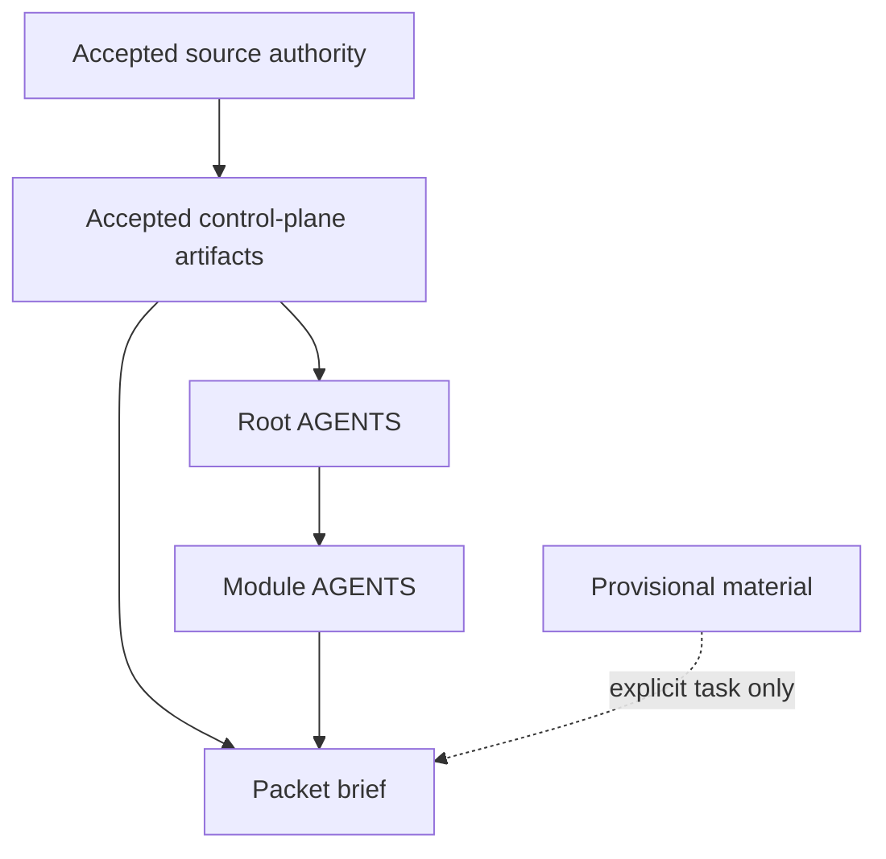

# Repo / Agent Operating Contract
Version: 1.0
Status: Accepted
Task: P0.2 — Lightweight repo / agent operating contract

## 1. Purpose

This spec defines the lightweight repo-wide operating contract for humans and agents.

It establishes:

- repo-wide default instruction behavior,
- module-local narrowing rules,
- the accepted-artifact-only default,
- the baseline packet-brief contract for bounded work.

This is a control-plane operating spec.
It is not a product-runtime schema.
It does not define Factory-specific automation behavior; that belongs to P0.3.

## 2. Scope boundaries

### In scope

- Repo-wide `AGENTS.md` behavior
- Module-local `AGENTS.md` narrowing rules
- Accepted-artifact-only operating rule
- Lightweight packet-brief baseline
- Control-plane registration and update expectations for accepted P0.2 artifacts

### Out of scope

- Factory-specific skills, droid conventions, or headless-run review rules
- Runtime product object schemas or app-specific execution policies
- Packet size budgets or context-compilation policy for execution packets
- Any second orchestration stack

## 3. Design constraints carried forward

- Three-layer architecture remains fixed: engine, shared environment, and app/domain.
- Chat is a projection over the substrate, not the source of truth.
- Task Studio remains the north-star commissioned-work app.
- The chat-native release order is fixed.
- No repo artifact may invent a private competing truth model.
- Repo layout is a storage convention, not the platform architecture.
- Product truth remains human-owned.
- Factory.ai is the base execution tool; CrewAI is not part of the base plan.
- Reuse the accepted P0.1 artifact model, validation-hook standards, dependency edge semantics, and stale rules.

## 4. Operating objects

### 4.1 Accepted artifact

An artifact is default-operable only when its registry status is `accepted`.
For P0.2 this means accepted source-authority artifacts and accepted control-plane artifacts.

### 4.2 Provisional material

Anything not accepted is provisional by default, including:

- drafts,
- review-ready artifacts,
- stale artifacts,
- superseded artifacts,
- archived artifacts,
- rejected artifacts,
- notes,
- unregistered working material.

### 4.3 AGENTS projection

An `AGENTS.md` file is an execution projection of accepted repo truth for a repo or subtree.
It does not create a new truth model.

### 4.4 Packet brief

A packet brief is a lightweight bounded-work contract.
It constrains execution scope but does not override accepted truth.

## 5. Truth and instruction precedence

Comment: packet briefs narrow execution; they do not replace accepted truth.

### 5.1 Accepted-artifact-only default

- Agents and humans may rely on accepted artifacts by default.
- Non-accepted artifacts and other working material must be treated as provisional unless the task explicitly targets them.
- When provisional material is used on purpose, the work must preserve that provisional status and must not present it as accepted repo truth.
- Accepted baseline decisions remain closed unless the task explicitly requests reopening them.

### 5.2 Root and module-local instructions

- The root `AGENTS.md` sets repo-wide default operating rules.
- The nearest descendant `AGENTS.md` adds subtree-local narrowing rules.
- Descendant `AGENTS.md` files may narrow root rules but must not silently conflict with or widen them.
- If a descendant rule appears to conflict with accepted upstream truth, the accepted artifact wins and the descendant rule must be corrected rather than treated as an alternate truth source.

### 5.3 Fixed-location projections

- `AGENTS.md` files may live at repo root or subtree roots.
- Their file location does not change their control-plane role.
- They may be registered as control-plane spec artifacts even when they are not stored under `docs/control-plane/core/`.

## 6. Packet brief baseline

A P0.2 packet brief must be lightweight but concrete enough for later bounded execution work.

Minimum fields:

- `packet_id`
- `title`
- `task_id`
- `objective`
- `scope`
- `out_of_scope`
- `source_authority_refs`
- `accepted_artifact_refs`
- `file_targets` or `file_whitelist_ref`
- `deliverables`
- `validation_hooks`
- `approval_requirements`
- `execution_mode`
- `carry_forward_topics`
- `notes`

Rules:

- A packet brief narrows work to an explicit scope, file set, deliverable set, validation set, and approval set.
- `accepted_artifact_refs` must point to accepted repo artifacts that the work may rely on by default.
- `source_authority_refs` must identify the governing source documents when they materially shape the work.
- Packet briefs must not add P0.3-specific Factory run conventions or approval machinery.
- Packet briefs must not override root or module `AGENTS.md` rules.

## 7. Control-plane update rules

- New accepted P0.2 artifacts must use the accepted P0.1 artifact types, validation hooks, dependency semantics, and stale rules.
- New accepted artifacts must be registered in `docs/control-plane/artifact-registry.seed.json`.
- Their dependency edges must be represented in `docs/control-plane/dependency-graph.seed.json`.
- `docs/control-plane/core/master-plan.md` status updates may be applied only after deliverables exist and the required validations pass.
- Carry-forward entries in `docs/control-plane/core/master-plan.md` remain append-only.

## 8. Validation expectations for P0.2

P0.2 acceptance requires real checks that currently exist:

1. JSON parse for edited or created `.json` files.
2. Dependency-integrity verification that new graph references resolve to registry artifact IDs.
3. Verification that artifact types, validation hooks, and stale rules come from accepted P0.1 catalogs.
4. Cross-file consistency for the accepted-artifact-only rule across the normative spec and both `AGENTS.md` projections.
5. Final scope review confirming no P0.3-only behavior was pulled into P0.2.

## 9. Why this preserves the baseline

This operating contract does not:

- replace the accepted source-authority stack,
- turn repo layout into product architecture,
- invent Factory-specific execution policy early,
- reopen accepted baseline decisions,
- create a second orchestration stack,
- or treat drafts and notes as default truth.
